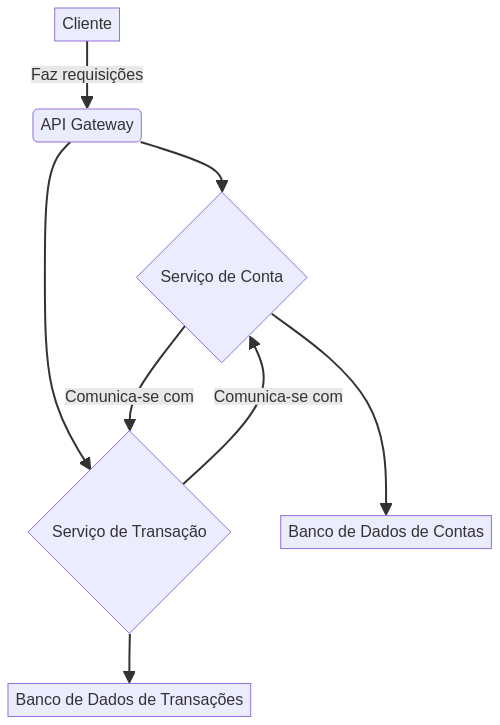

# Banking System Architecture (Java)


## 🇧🇷 Português

Este projeto demonstra uma arquitetura de sistema bancário robusta e escalável desenvolvida em Java, utilizando o framework Spring Boot. O objetivo é apresentar as melhores práticas de desenvolvimento de software, incluindo design de API RESTful, persistência de dados com JPA, testes unitários e de integração, e uma estrutura de projeto organizada.

### Funcionalidades

-   **Gerenciamento de Contas**: Criação, consulta e exclusão de contas bancárias.
-   **Operações Financeiras**: Depósito, saque e transferência entre contas.
-   **API RESTful**: Interface bem definida para interação com o sistema.
-   **Persistência de Dados**: Utilização de JPA com H2 Database (em memória para desenvolvimento/testes).
-   **Testes Abrangentes**: Cobertura de testes para garantir a confiabilidade das operações.

### Arquitetura

O sistema segue uma arquitetura de microserviços simplificada, com foco na separação de responsabilidades e modularidade. O diagrama abaixo ilustra os componentes principais e suas interações:



### Pré-requisitos

-   Java Development Kit (JDK) 17 ou superior
-   Apache Maven 3.6 ou superior

### Como Executar

1.  **Clone o repositório:**
    ```bash
    git clone https://github.com/galafis/banking-system-architecture-java.git
    cd banking-system-architecture-java
    ```
2.  **Compile o projeto:**
    ```bash
    mvn clean install
    ```
3.  **Execute a aplicação:**
    ```bash
    mvn spring-boot:run
    ```
    A aplicação estará disponível em `http://localhost:8080`.

### Exemplos de Uso da API

Você pode usar ferramentas como `curl` ou Postman para interagir com a API.

#### Criar uma nova conta

```bash
curl -X POST http://localhost:8080/api/accounts \
-H "Content-Type: application/json" \
-d '{"accountNumber": "1001", "accountHolderName": "Gabriel Lafis", "balance": 1500.00}'
```

#### Depositar em uma conta

```bash
curl -X PUT http://localhost:8080/api/accounts/1001/deposit \
-H "Content-Type: application/json" \
-d '{"amount": 200.00}'
```

#### Sacar de uma conta

```bash
curl -X PUT http://localhost:8080/api/accounts/1001/withdraw \
-H "Content-Type: application/json" \
-d '{"amount": 150.00}'
```

#### Transferir entre contas

```bash
curl -X PUT http://localhost:8080/api/accounts/transfer \
-H "Content-Type: application/json" \
-d '{"fromAccountNumber": "1001", "toAccountNumber": "1002", "amount": 50.00}'
```

### Testes

Para executar os testes unitários e de integração:

```bash
mvn test
```

## 🇬🇧 English

This project demonstrates a robust and scalable banking system architecture developed in Java, using the Spring Boot framework. The goal is to showcase software development best practices, including RESTful API design, data persistence with JPA, unit and integration testing, and an organized project structure.

### Features

-   **Account Management**: Creation, retrieval, and deletion of bank accounts.
-   **Financial Operations**: Deposit, withdrawal, and transfer between accounts.
-   **RESTful API**: Well-defined interface for system interaction.
-   **Data Persistence**: Usage of JPA with H2 Database (in-memory for development/testing).
-   **Comprehensive Testing**: Test coverage to ensure the reliability of operations.

### Architecture

The system follows a simplified microservices architecture, focusing on separation of concerns and modularity. The diagram below illustrates the main components and their interactions:


### Prerequisites

-   Java Development Kit (JDK) 17 or higher
-   Apache Maven 3.6 or higher

### How to Run

1.  **Clone the repository:**
    ```bash
    git clone https://github.com/galafis/banking-system-architecture-java.git
    cd banking-system-architecture-java
    ```
2.  **Compile the project:**
    ```bash
    mvn clean install
    ```
3.  **Run the application:**
    ```bash
    mvn spring-boot:run
    ```
    The application will be available at `http://localhost:8080`.

### API Usage Examples

You can use tools like `curl` or Postman to interact with the API.

#### Create a new account

```bash
curl -X POST http://localhost:8080/api/accounts \
-H "Content-Type: application/json" \
-d '{"accountNumber": "1001", "accountHolderName": "Gabriel Lafis", "balance": 1500.00}'
```

#### Deposit into an account

```bash
curl -X PUT http://localhost:8080/api/accounts/1001/deposit \
-H "Content-Type: application/json" \
-d '{"amount": 200.00}'
```

#### Withdraw from an account

```bash
curl -X PUT http://localhost:8080/api/accounts/1001/withdraw \
-H "Content-Type: application/json" \
-d '{"amount": 150.00}'
```

#### Transfer between accounts

```bash
curl -X PUT http://localhost:8080/api/accounts/transfer \
-H "Content-Type: application/json" \
-d '{"fromAccountNumber": "1001", "toAccountNumber": "1002", "amount": 50.00}'
```

### Tests

To run unit and integration tests:

```bash
mvn test
```

---

**Author:** Gabriel Demetrios Lafis


